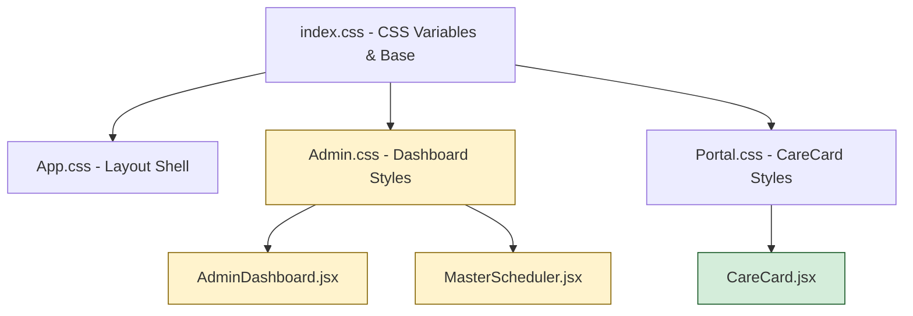

# Design Document: Mobile Admin UX Polish

## Overview

This design addresses the mobile usability, visual polish, and owner-friendly language improvements for the Tog & Dogs operations portal. All changes are strictly frontend-only — no backend APIs, DynamoDB schema, Cognito configuration, or RBAC logic will be modified.

The portal is a React 19 SPA built with Vite, using plain CSS with CSS custom properties for theming. The primary component affected is `AdminDashboard.jsx` (≈3000 lines), which contains the request list, staff management, client management, and scheduler views inline. Supporting components include `MasterScheduler.jsx` and `CareCard.jsx`.

### Design Principles

1. **Incremental & Safe** — Each change is isolated to CSS or JSX label text. No data flow or API contract changes.
2. **Mobile-First Responsive** — Add responsive breakpoints to existing CSS rather than rewriting layouts.
3. **Owner-Friendly Language** — Map technical status values to plain business language at the display layer only.
4. **Accessibility** — Meet WCAG 2.1 AA for contrast, tap targets, focus indicators, and keyboard navigation.

---

## Architecture

### Current Frontend Structure

```
web/src/
├── App.jsx                    # Router, header, footer
├── App.css                    # Global header/footer/nav styles
├── index.css                  # CSS custom properties, typography, base styles
├── Admin.css                  # Admin dashboard layout, table, modal, status chips
├── Portal.css                 # CareCard/portal styles
├── main.jsx                   # Entry point
├── components/
│   ├── AdminDashboard.jsx     # Main admin component (3000 lines, all views)
│   ├── MasterScheduler.jsx    # Scheduler timeline view
│   ├── CareCard.jsx           # Pet record detail modal/overlay
│   ├── ClientPortal.jsx       # Client-facing booking view
│   ├── UserProfile.jsx        # User avatar/profile dropdown
│   └── ...
├── api/
│   ├── auth.js                # Cognito authentication
│   ├── client.js              # API calls (admin actions, CRUD)
│   └── config.js              # API endpoint configuration
├── config/
│   └── siteContent.js         # Site copy/content
└── constants/
    └── staff.js               # Hardcoded staff list (legacy)
```

### Key Technical Facts

- **Framework**: React 19.2 with react-router-dom 7.14
- **Build**: Vite 8.0
- **CSS Approach**: Plain CSS files with CSS custom properties (no CSS-in-JS, no Tailwind, no preprocessor)
- **State Management**: Local component state via `useState`/`useEffect` (no Redux/Zustand)
- **Theming**: Light/dark mode via `:root` and `:root.dark` CSS variable overrides
- **Existing Breakpoints**: `@media (max-width: 1024px)`, `@media (max-width: 768px)`, `@media (max-width: 640px)`
- **Authentication**: AWS Cognito via `amazon-cognito-identity-js`

### Change Strategy

This feature will NOT restructure the component architecture. Changes are limited to:
1. **CSS additions** in `Admin.css` and `index.css` (new mobile breakpoints, card layouts)
2. **Label text changes** in `AdminDashboard.jsx` (status mapping, button labels, helper text)
3. **Minor JSX restructuring** within existing components (grouping fields, adding helper text)
4. **No new dependencies** — all changes use existing React and CSS capabilities



*Yellow = primary changes, Green = minor changes*

---

## Components and Interfaces

### Components Affected

| Component | File Path | Changes |
|-----------|-----------|---------|
| AdminDashboard | `web/src/components/AdminDashboard.jsx` | Status label mapping update, button label text, helper text, field grouping, confirmation dialog wording, protected account labels |
| MasterScheduler | `web/src/components/MasterScheduler.jsx` | Mobile list layout for scheduler, empty state message |
| CareCard | `web/src/components/CareCard.jsx` | Full-screen mobile modal, scroll lock |
| Admin CSS | `web/src/Admin.css` | Mobile breakpoints, card layouts, tap targets, button hierarchy |
| Index CSS | `web/src/index.css` | Mobile typography, global responsive tokens |
| App CSS | `web/src/App.css` | Mobile header/nav adjustments |

### New Utility: Status Label Mapping

The existing `getStatusLabel()` function in `AdminDashboard.jsx` will be updated to match the requirements specification. The function signature remains unchanged:

```javascript
const getStatusLabel = (status = "", item = null) => { ... }
```

**Current behavior** (partial mapping, some labels like "Needs M&G" are abbreviated):
- `MEET_GREET_REQUIRED` → "Needs M&G"
- `APPROVED` (VISIT_BOOKING) → "Booked"
- `ASSIGNED` → "Scheduled"

**Updated behavior** (owner-friendly, per Requirement 6):
- `MEET_GREET_REQUIRED` / `NEEDS_MG` → "Needs Meet & Greet"
- `QUOTE_NEEDED` → "Needs Price Quote"
- `APPROVED` / `BOOKED` (VISIT_BOOKING) → "Approved / Ready to Schedule"
- `ASSIGNED` / `JOB_CREATED` / `SCHEDULED` → "Scheduled with Staff"
- `COMPLETED` → "Visit Completed"
- `ARCHIVED` / `ARCHIVE` → "Saved for Records"
- `DELETED` / `DELETE` / `TRASH` → "Trash"
- Unknown values → Title case with underscores replaced by spaces

**Fallback rule**: Any status not in the known mapping will be formatted as:
```javascript
status.replace(/_/g, ' ').replace(/\b\w/g, c => c.toUpperCase())
```

### Confirmation Dialog Interface

Confirmation dialogs will be enhanced to include:
- **Person name** (display_name of affected user)
- **Action description** in plain language
- **Reversibility statement** (e.g., "This can be undone by restoring login access")
- **Distinct Confirm button** for destructive actions

The existing `window.confirm()` calls in staff/client action handlers will be replaced with the existing modal overlay pattern (`modal-overlay` + `modal-content`).

---

## Data Models

No data model changes. This feature is frontend-only.

The status label mapping is a **display-only transformation**. The `getStatusLabel()` function is called exclusively in render paths:
- Table cell rendering (`getWorkflowState` → `displayStatus`)
- Sidebar filter labels
- Notification messages

Backend API calls (`reviewRequest`, `performAdminAction`, `updateStaff`, etc.) continue to use raw status values (`PENDING_REVIEW`, `APPROVED`, `DELETED`, etc.) unchanged.

---

## Correctness Properties

*A property is a characteristic or behavior that should hold true across all valid executions of a system — essentially, a formal statement about what the system should do. Properties serve as the bridge between human-readable specifications and machine-verifiable correctness guarantees.*

### Property 1: Status Label Mapping Correctness

*For any* known backend status value and workflow type combination defined in the requirements specification, the `getStatusLabel` function SHALL return the exact owner-friendly label specified for that combination.

**Validates: Requirements 6.1, 6.2, 6.3, 6.4, 6.5, 6.6, 6.7, 6.8, 6.9**

### Property 2: Unknown Status Fallback Formatting

*For any* string that is not a recognized backend status value, the `getStatusLabel` function SHALL return that string with underscores replaced by spaces and each word capitalized (title case), and SHALL NOT return an empty string or undefined.

**Validates: Requirements 6.10**

### Property 3: Protected and Self-Account Guardrails

*For any* staff object that matches the protected account criteria (matching `PROTECTED_SUBS` or `PROTECTED_EMAILS`) OR matches the current user's identity, the destructive action controls (disable access, set temporary password, send password reset, delete profile) SHALL be disabled (not clickable/invocable).

**Validates: Requirements 9.1, 9.3**

---

## Error Handling

### Graceful Degradation

- **Missing status value**: If `status` is `null`, `undefined`, or empty string, `getStatusLabel` returns "Unknown / Status Missing" (existing behavior preserved).
- **Missing workflow type**: If `item` is null or has no `workflow_type`, `determineWorkflowType` defaults to `CUSTOMER_INTAKE` (existing behavior preserved).
- **CSS fallback**: All responsive styles use progressive enhancement — mobile styles are additive `@media` rules that don't break desktop layout if they fail to load.

### Modal Scroll Lock

When a modal opens on mobile:
1. `document.body.style.overflow = 'hidden'` prevents background scroll
2. On modal close, `document.body.style.overflow = ''` restores scrolling
3. If the component unmounts without closing (navigation), a cleanup effect restores scroll

### Protected Account Edge Cases

- If `PROTECTED_SUBS` or `PROTECTED_EMAILS` arrays are empty or undefined, `isProtectedProfile` returns `false` (safe default — no accounts are over-protected).
- If `currentUser` is null (shouldn't happen when authenticated), `isSelf` returns `false`.
- Disabled buttons use both `disabled` attribute AND pointer-events CSS to prevent click-through.

---

## Testing Strategy

### Approach

This feature uses a **dual testing approach**:
1. **Property-based tests** for the pure logic functions (status label mapping, protected account checks)
2. **Manual/visual testing** for CSS layout, responsiveness, and visual polish
3. **Build verification** to ensure no regressions

### Property-Based Tests

**Library**: A lightweight PBT library compatible with the project (e.g., `fast-check` for JavaScript).

**Configuration**: Minimum 100 iterations per property test.

**Tag format**: `Feature: mobile-admin-ux-polish, Property {number}: {property_text}`

| Property | Test Description | Iterations |
|----------|-----------------|------------|
| 1 | Generate all known status/workflow pairs, verify correct label output | 100+ |
| 2 | Generate random strings NOT in known set, verify title-case formatting | 100+ |
| 3 | Generate staff objects with protected/self attributes, verify controls disabled | 100+ |

### Unit Tests (Example-Based)

| Area | Test |
|------|------|
| Button labels | Staff management renders "Turn Off Login Access" not "Disable user" |
| Button labels | Staff management renders "Set Temporary Password" not "Set Temp Pass" |
| Button labels | Staff management renders "Send Password Reset Email" not "Send Reset" |
| No Cognito text | Staff/Client management contains no "Cognito" or "User Pool" strings |
| Helper text | Login identity section shows "used for signing in" helper |
| Confirmation | Destructive action dialog includes person name and reversibility |
| Sidebar labels | Filter labels match owner-friendly status labels |

### Build Verification

```bash
cd web/
npm run build   # Must exit 0
npm run lint    # Must produce no new warnings
```

### Manual Testing Checklist

| Viewport | Area | Check |
|----------|------|-------|
| 390px | Dashboard | No horizontal scroll, cards stack vertically |
| 390px | Request List | Cards not table rows, 44px tap targets |
| 390px | Modals | Full-screen, scroll lock works, close button accessible |
| 390px | Staff Mgmt | Single column cards, all buttons reachable |
| 390px | Scheduler | Vertical list, no horizontal timeline |
| 768px | Dashboard | Two-column stat cards, 8px spacing |
| 1440px | All | No visual regressions from current state |
| All | Keyboard | Focus indicators visible on all interactive elements |
| All | Contrast | Text meets 4.5:1, interactive elements meet 3:1 |

---

## CSS/Layout Strategy for Mobile

### Breakpoint System

Extend the existing breakpoint system with a new `390px` breakpoint for mobile:

```css
/* Existing breakpoints (preserved) */
@media (max-width: 1024px) { /* Tablet landscape */ }
@media (max-width: 768px)  { /* Tablet portrait */ }
@media (max-width: 640px)  { /* Small tablet / large phone */ }

/* New breakpoint */
@media (max-width: 480px)  { /* Mobile phones (covers 390px iPhone) */ }
```

### Key CSS Changes

**Stat Cards** — Single column on mobile, two-column on tablet:
```css
@media (max-width: 480px) {
  .admin-stats-grid {
    grid-template-columns: 1fr;
    gap: 12px;
  }
}
@media (min-width: 481px) and (max-width: 768px) {
  .admin-stats-grid {
    grid-template-columns: 1fr 1fr;
    gap: 8px;
  }
}
```

**Request Table → Card Layout** on mobile:
```css
@media (max-width: 480px) {
  .request-table { display: block; }
  .request-table thead { display: none; }
  .request-table tbody tr {
    display: flex;
    flex-direction: column;
    padding: 16px;
    margin-bottom: 12px;
    border-radius: var(--radius-md);
    border: 1px solid var(--border-color);
  }
  .request-table td { 
    display: block; 
    padding: 8px 0;
    border: none;
  }
}
```

**Tap Targets** — Minimum 44x44px:
```css
@media (max-width: 480px) {
  .btn-small, .btn-micro, .button-primary, .button-secondary,
  .filter-option, .dropdown-item {
    min-height: 44px;
    min-width: 44px;
    padding: 12px 16px;
  }
}
```

**Modal Full-Screen on Mobile**:
```css
@media (max-width: 480px) {
  .modal-content {
    width: 100%;
    height: 100%;
    max-width: 100%;
    border-radius: 0;
    overflow-y: auto;
    -webkit-overflow-scrolling: touch;
  }
}
```

---

## Owner-Friendly Wording Strategy

### Implementation Approach

The `getStatusLabel()` function already exists and handles most mappings. The changes are:

1. **Update return values** to match Requirement 6 exactly
2. **Add fallback formatting** for unknown statuses (title case with spaces)
3. **Update sidebar filter labels** to use the same friendly names
4. **Replace button labels** in staff/client management JSX

### Label Change Summary

| Location | Current | New |
|----------|---------|-----|
| Status chip | "Needs M&G" | "Needs Meet & Greet" |
| Status chip | "Booked" | "Approved / Ready to Schedule" |
| Status chip | "Scheduled" | "Scheduled with Staff" |
| Status chip | "Completed" | "Visit Completed" |
| Status chip | "Archived" | "Saved for Records" |
| Status chip | "Deleted" | "Trash" |
| Staff button | "Disable Access" | "Turn Off Login Access" |
| Staff button | "Enable Access" | "Restore Login Access" |
| Staff button | "Set Temp Pass" | "Set Temporary Password" |
| Staff button | "Send Reset" | "Send Password Reset Email" |
| Staff label | "Role" | "Access Level" |
| Staff text | "Cognito Only" | "Login Only (No Profile)" |
| Staff text | "Link Cognito Login" | "Link Login Account" |

---

## Staff/Client Management UX Strategy

### Field Grouping

Both Staff and Client management forms will be restructured into two visual groups:

**Group 1: Login Identity**
- Section heading: "Login Identity"
- Helper text: "This email address is used for signing in."
- Fields: Email (read-only when editing)

**Group 2: Profile Details**
- Section heading: "Profile Details"
- Helper text: "These fields are for display purposes only and do not affect login."
- Fields: Display Name, Phone, Notes (Staff) / Address, Emergency Contact, Notes (Client)

### Visual Separation

Groups are separated by:
- A distinct `<h4>` section heading
- 24px vertical spacing between groups
- A subtle 1px border or increased whitespace

### Cognito Term Removal

All instances of "Cognito" in user-facing text will be replaced:
- "Onboard New Cognito User" → "Create Login & Profile"
- "Create Local Profile Only" → "Create Profile Only (No Login)"
- "Cognito Only" badge → "Login Only"
- "Link Cognito Login" → "Link Login Account"
- "Disable Cognito" → "Turn Off Login Access"
- "Delete Cognito User" → "Delete Login Account"
- "Send setup email via Cognito" → "Send setup email with login instructions"

---

## Modal/Mobile Behavior Strategy

### Full-Screen Mobile Modals

On viewports ≤ 480px:
1. `.modal-content` expands to `width: 100%; height: 100dvh; border-radius: 0;`
2. Close button positioned at top-right with `position: sticky; top: 0;` and 44x44px tap target
3. Content area uses `overflow-y: auto` with `-webkit-overflow-scrolling: touch`

### Scroll Lock Implementation

```javascript
// In modal open handler:
useEffect(() => {
  if (modalOpen) {
    document.body.style.overflow = 'hidden';
    document.body.style.position = 'fixed';
    document.body.style.width = '100%';
  }
  return () => {
    document.body.style.overflow = '';
    document.body.style.position = '';
    document.body.style.width = '';
  };
}, [modalOpen]);
```

This prevents iOS Safari's rubber-band scrolling from scrolling the background while the modal is open.

### Existing Modals Affected

- `decisionModal` (workflow review)
- `bulkConfirmModal` (bulk action confirmation)
- `purgeModal` (permanent delete confirmation)
- `CareCard` (pet record detail — already uses overlay pattern)
- New: Staff/Client action confirmation modals (replacing `window.confirm`)

---

## Accessibility Considerations

### Contrast Ratios

The existing color palette already uses warm, accessible colors. Verification needed:
- `--text-primary: #3c3c3b` on `--page-bg: #faf7f2` → 9.7:1 ✓
- `--text-muted: #8a8a86` on `--page-bg: #faf7f2` → 3.5:1 (borderline for body text — may need darkening to `#6a6a66` for 4.5:1)
- Status chip text colors are already high-contrast (verified in existing CSS)

### Focus Indicators

Add visible focus styles for all interactive elements:
```css
:focus-visible {
  outline: 3px solid var(--primary);
  outline-offset: 2px;
  border-radius: 4px;
}
```

### Tap Targets

All interactive elements at mobile viewport will have:
- Minimum 44x44px touch area (per WCAG 2.5.5 Target Size)
- Minimum 8px spacing between adjacent targets (per WCAG 2.5.8 Target Size Minimum)

### Keyboard Navigation

- All modals trap focus within the modal when open
- Escape key closes modals
- Tab order follows visual order
- Action dropdown menus are keyboard-navigable with arrow keys

### Screen Reader Considerations

- Status chips use `aria-label` with the full friendly label
- Action buttons have descriptive `aria-label` attributes
- Modal close buttons have `aria-label="Close dialog"`
- Disabled buttons include `aria-disabled="true"` and `title` explaining why

---

## Validation Plan

### Pre-Merge Checklist

1. **Build passes**: `cd web/ && npm run build` exits with code 0
2. **Lint passes**: `cd web/ && npm run lint` produces no new warnings
3. **No backend files modified**: Git diff contains only `web/src/` files
4. **Property tests pass**: Status label mapping and protected account tests green
5. **Manual mobile test**: Verify at 390px, 768px, and 1440px viewports

### Testing Sequence

1. Run `npm run build` after each significant change
2. Test mobile layout in browser DevTools at 390px
3. Verify all status labels match requirements spec
4. Verify no "Cognito" or "User Pool" text visible in UI
5. Verify protected account buttons are disabled
6. Verify confirmation dialogs include person name and action description
7. Test keyboard navigation through all interactive elements
8. Run Lighthouse accessibility audit

---

## Risks and Rollback Considerations

### Risks

| Risk | Likelihood | Impact | Mitigation |
|------|-----------|--------|------------|
| CSS changes break desktop layout | Low | Medium | Use additive `@media` rules only; test at 1440px after each change |
| Status label changes confuse Ryan initially | Low | Low | Labels are more descriptive, not less; brief walkthrough on deploy |
| Modal scroll lock breaks on iOS Safari | Medium | Low | Use `position: fixed` + `width: 100%` pattern; test on real device |
| Inline styles in JSX conflict with new CSS | Medium | Low | CSS specificity will override; use `!important` sparingly if needed |
| Large AdminDashboard.jsx diff causes merge conflicts | Medium | Medium | Make changes in logical commits; coordinate with any parallel work |

### Rollback Strategy

Since all changes are frontend-only and additive:
1. **Git revert**: Single `git revert` of the merge commit restores previous state
2. **No data migration needed**: No schema or API changes to roll back
3. **No infrastructure changes**: No CloudFormation/SAM templates modified
4. **Instant rollback**: Redeploy previous `web/dist/` build artifacts

### What Could Go Wrong

1. **CSS specificity conflicts**: Existing inline styles (heavy use of `style={{...}}` in JSX) may override new CSS classes. Solution: Convert critical inline styles to CSS classes during implementation.
2. **Dark mode regression**: New CSS rules must include `:root.dark` variants. Solution: Test both themes at each breakpoint.
3. **Long component file**: At 3000 lines, `AdminDashboard.jsx` is fragile. Solution: Make minimal, targeted changes; avoid refactoring structure in this PR.
