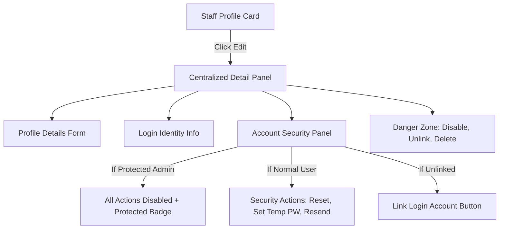

# Release 22A — Identity/Profile Management and Care Request Validation Defect Triage

**Status:** Completed (PASS)  
**Date:** 2026-07-09  
**Author:** Antigravity  

---

## Executive Summary

This document performs read-only source-code triage of several identity/profile management defects observed during active staff list validation, as well as UX issues related to validation feedback on the public care request form (`/book`). 

This analysis details the exact root causes, lists the files and routes involved, and provides a clear remediation plan and a proposed UX model for a centralized Profile Editor / Identity Management panel.

---

## Triage Objectives & Root Cause Analyses

### A. Identity & Profile Action Defects

#### 1. Resend Invite "UnboundLocalError" (Ryan York)
* **Observed Error:** `cannot access local variable 'notify_event' where it is not associated with a value`
* **Root Cause:** In `src/backend/handlers/admin_handler.py`, the notification dispatch function `notify_event` is imported at the global scope (line 6):
  ```python
  from common.notifications.service import notify_event
  ```
  However, inside the `handler` function body at line 2327 (under the payment email trigger block), there is a local duplicate import statement:
  ```python
  from common.notifications.service import notify_event
  ```
  In Python, if a variable name is imported or assigned inside a function body, it is bound as a local variable for the **entire** scope of that function. Because of this local binding, accessing `notify_event` at line 1508 (inside the invitation resend block, which is evaluated before the payment block) raises `UnboundLocalError: local variable 'notify_event' referenced before assignment`.
* **Classification:** Backend-only code defect.
* **Files/Routes Involved:** [admin_handler.py](file:///c:/Users/mattn/OneDrive/Desktop/togs_and_dogs_website/src/backend/handlers/admin_handler.py#L6,L1508,L2327)
* **Recommended Fix:** Delete the duplicate local import `from common.notifications.service import notify_event` at line 2327.

#### 2. Resend Invite "Cognito user not found" (USmissionhero)
* **Observed Error:** `Cognito user not found`
* **Root Cause:** The DynamoDB profile for `USmissionhero` (SK: `STAFF#staff_829e01ba`) is linked to Cognito via a hardcoded/legacy sub value `"e4f84428-5071-70ec-30d1-5a79238828f8"`. However, no user with this sub or matching the email `mbn@usmissionhero.com` exists in the Cognito User Pool (`us-east-1_counlsXGU`). When `admin_get_user` or the fallback `list_users` filter is executed, Cognito returns empty results, causing the backend to return `400 Bad Request` with the message `"Cognito user not found"`.
* **Classification:** Cognito-linkage/orphan database record.
* **Files/Routes Involved:** [admin_handler.py](file:///c:/Users/mattn/OneDrive/Desktop/togs_and_dogs_website/src/backend/handlers/admin_handler.py#L1429-L1453)
* **Recommended Fix:** Provide a backend cleanup mechanism or a UI button to unlink orphaned profiles from deleted Cognito users, allowing them to be relinked.

#### 3. Send Password Reset & Set Temporary Password "Failed to fetch" (Ryan York)
* **Observed Error:** `Failed to fetch`
* **Root Cause:** The client code attempts to call `/admin/staff/{staff_id}/reset-password` and `/admin/staff/{staff_id}/set-temp-password`. However, these specific resources and routes are **not configured** in API Gateway for staff (they were only configured in `modules/api/main.tf` for clients, i.e., `/admin/clients/{client_id}/reset-password`). Because the routes do not exist, the browser's HTTP preflight (CORS) or POST request is rejected, resulting in a browser-level network error (`Failed to fetch`).
* **Classification:** Infrastructure configuration gap (Terraform).
* **Files/Routes Involved:** [modules/api/main.tf](file:///c:/Users/mattn/OneDrive/Desktop/togs_and_dogs_website/modules/api/main.tf)
* **Recommended Fix:** Add the `reset-password` and `set-temp-password` API Gateway resources, methods, integrations, and CORS OPTIONS rules for staff paths in `modules/api/main.tf`.

#### 4. USmissionhero Password Reset / Temp Password Scroll-to-Top (No Confirmation)
* **Observed Behavior:** No confirmation modal displays; the page scrolls to the top.
* **Root Cause:** 
  1. USmissionhero is a platform support account with the fallback email `mbn@usmissionhero.com`. The backend handler adds the dynamically calculated attribute `'is_protected': True` to this profile in the staff list response.
  2. On the frontend, `isProtectedProfile(s)` evaluates to `true` for USmissionhero, which disables the security action buttons on their card in the UI.
  3. Clicking a disabled button does not trigger the button's action click handler. However, the parent staff card `div` has `onClick={() => handleEditStaff(s)}`.
  4. Clicking on the disabled button bubbles the click event up to the card container, which triggers `handleEditStaff(s)`. This function populates the editing form and performs a smooth scroll to the top: `window.scrollTo({ top: 0, behavior: 'smooth' })`. Since the button's action handler was disabled, no confirmation modal is opened.
* **Classification:** Frontend UI event bubbling issue.
* **Files/Routes Involved:** [AdminDashboard.jsx](file:///c:/Users/mattn/OneDrive/Desktop/togs_and_dogs_website/web/src/components/AdminDashboard.jsx#L1555,L3821,L3861)
* **Recommended Fix:** Add `e.stopPropagation()` inside all button click handlers inside the staff card to prevent clicks from bubbling to the parent `div`.

---

### B. Profile Action State Classifications

| State | Profile Status | Linked Login | Destructive Actions | Security Actions |
|-------|----------------|--------------|---------------------|------------------|
| **Profile Only** | Active, no credentials | None | Disable Profile, Delete Profile | Link Login Account |
| **Login Linked & Active** | Active | Confirmed Cognito User | Disable Login, Unlink, Delete | Send Password Reset, Set Temp PW |
| **Login Invited** | Pending invite | Invited Cognito User (`FORCE_CHANGE_PASSWORD`) | Disable Login, Unlink, Delete | Resend Invite, Set Temp PW |
| **Login Disabled** | Deactivated | Disabled Cognito User | Restore Login, Unlink, Delete | None (Blocked) |
| **Protected Admin** | Active platform admin | Cognito User (system fallback) | Blocked (backend & frontend) | Blocked (backend & frontend) |

---

### C. Proposed Centralized Profile & Identity Editor

To reduce UI clutter on staff cards and improve security validation, we recommend moving account actions from individual cards into a centralized **Identity & Profile Editor** panel (slide-out drawer or detail view).



#### Proposed Panel Sections:
1. **Staff/Profile Details:** Edit display name, role, email, phone, is_assignable status, and notes.
2. **Login Identity Status:** Display current Cognito status (`CONFIRMED`, `FORCE_CHANGE_PASSWORD`, `DISABLED`, or `UNLINKED`) with appropriate badges.
3. **Account Security:** 
   * **Resend Invite:** Only visible/enabled when status is `FORCE_CHANGE_PASSWORD` or `UNCONFIRMED`.
   * **Send Password Reset:** Enabled when status is `CONFIRMED`.
   * **Set Temporary Password:** Enabled when status is `FORCE_CHANGE_PASSWORD` or `UNCONFIRMED`.
4. **Protected Guardrails:** If the account has `is_protected: true`, hide all security/danger zone buttons and display a prominent warning banner: `"This is a protected platform admin account and cannot be modified."`
5. **Danger Zone:** Unlink Login (removes Cognito sub from DynamoDB), Turn Off Login Access (disables Cognito user), and Delete Profile.
6. **Audit History:** Read-only list of recent actions performed on this profile.

---

### D. Care Request Validation Triage (Step 2 - Schedule)

#### 1. Required Fields & Date Validation
* In `IntakeForm.jsx`, `validateStep` for Step 2 requires `formData.service_type` to be present and `formData.selected_dates` (an array) to have a length greater than 0.
* When validation fails, the form calls a generic browser `alert("Please fill in all required fields.")`.
* There is no field-specific visual indicator showing that dates have not been selected on the calendar grid.

#### 2. Recommended Frontend UX Improvements
* **Inline Field Errors:** Remove the browser `alert()` and render a clean, premium error alert box directly below the date picker or the "Next" button (e.g., `"Please select at least one visit date on the calendar."`).
* **Visual Highlighting:** If the dates validation fails, apply a shake animation and an error state border (`border: 2px solid var(--accent-red)`) to the `.intake-date-picker-card` element.
* **Auto-Scroll to Error:** If validation fails, use `element.scrollIntoView({ behavior: 'smooth', block: 'center' })` to automatically scroll the browser to the date picker card.
* **Summary Error Banner:** Show a visual summary card at the top of the form with links that scroll directly to the missing fields.
* **Clear Calendar State:** Explicitly display a text label like `"Dates Selected: 0 days (Minimum 1 day required)"` in red when the selection is empty.

---

## Next Steps / Fix Sequence

1. **Phase 1 (Backend Bug Fix):** Resolve the `UnboundLocalError` in `admin_handler.py`.
2. **Phase 2 (Infrastructure Config):** Deploy the missing API Gateway resources in `modules/api/main.tf`.
3. **Phase 3 (Frontend Event Handling):** Apply `e.stopPropagation()` to card buttons to prevent page jumping.
4. **Phase 4 (Centralized UI Refactor):** Build the Identity Management detail panel.
5. **Phase 5 (Public Intake Validation):** Refactor Step 2 validation feedback on `/book`.
