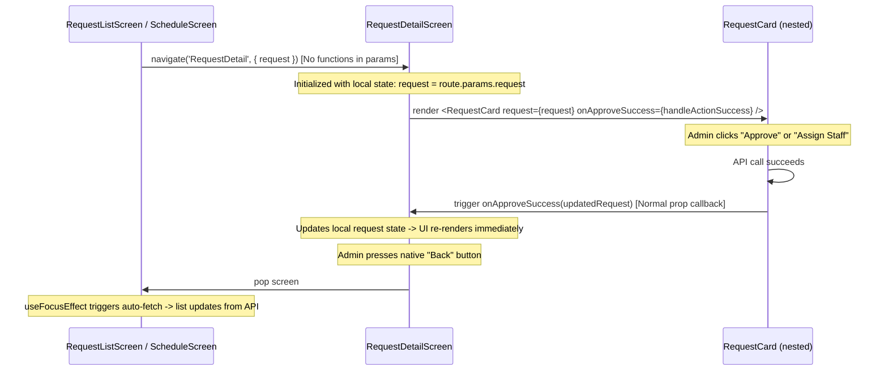

# Release 8O: Mobile Navigation & SafeArea Runtime Polish

**Status:** Planning
**Priority:** Medium (clean up runtime warnings and sanitize navigation state)
**Risk to Production:** None (mobile UI & navigation cleanup only, no backend changes)
**Terraform Required:** No
**Backend Changes:** None
**Scope:** Mobile app — clean up deprecated SafeAreaView imports, sanitize navigation parameters to remove functions, and align list/detail refresh flows.

---

## 1. Purpose

During the Release 8N physical iPhone runtime validation, the new Booking Details navigation and screen layout worked correctly, but Metro logged two warning messages:
1. `SafeAreaView has been deprecated and will be removed in a future release. Please use react-native-safe-area-context instead.`
2. `Non-serializable values were found in the navigation state. RequestDetail > params.onApproveSuccess (Function).`

This release aims to clean up these warnings, standardize safe area rendering, and ensure a robust, warn-free navigation parameter state while keeping live data refresh on mutations fully operational.

---

## 2. Current State & Issue Analysis

### A. Deprecated SafeAreaView Usage
React Native's core `SafeAreaView` has been deprecated in recent SDK versions in favor of the more flexible, inset-aware `SafeAreaView` from `react-native-safe-area-context`.
Currently, the mobile app contains imports from both packages:
- **Using `react-native-safe-area-context` (correct):** `BookingsScreen.tsx`, `DashboardScreen.tsx`, `LoginScreen.tsx`, `RequestListScreen.tsx`, `ScheduleScreen.tsx`.
- **Using `react-native` (deprecated):** `RequestDetailScreen.tsx` (Line 10), `StaffPickerSheet.tsx` (Line 10).

### B. Non-Serializable Navigation Parameters
In `ScheduleScreen.tsx` and `RequestCard.tsx`, the application navigates to the booking detail view by passing the original request details and a callback function parameter (`onApproveSuccess`):
```typescript
// Example from RequestCard.tsx:
navigation.navigate('RequestDetail', {
  request,
  onApproveSuccess, // <-- Function callback: causes non-serializable warning
});
```
Passing functions in navigation params prevents React Navigation from serializing state for persistence/restoration, triggering the console warnings.

---

## 3. Proposed Solution & Architecture

To resolve the warnings without breaking existing features, we will apply the following design pattern:



### 1. Standardize SafeAreaView
- Swap `SafeAreaView` imports in `RequestDetailScreen.tsx` and `StaffPickerSheet.tsx` from `'react-native'` to `'react-native-safe-area-context'`.

### 2. Sanitize Navigation Params
- Remove `onApproveSuccess` from all `navigation.navigate('RequestDetail', ...)` parameters in `RequestCard.tsx` and `ScheduleScreen.tsx`.
- Nav params will strictly contain serializable state (the `request` object and basic keys).

### 3. Detail View Local State Update
- In `RequestDetailScreen.tsx`, initialize a local React state for the active request details:
  ```typescript
  const [request, setRequest] = useState<PetRequest | null>(route.params?.request || null);
  ```
- Pass a local function `handleActionSuccess` as the `onApproveSuccess` prop to the nested `RequestCard`:
  ```typescript
  const handleActionSuccess = (updatedRequest?: PetRequest) => {
    if (updatedRequest) {
      setRequest(updatedRequest);
    }
  };
  ```

### 4. Propagate Status Changes Locally
- Modify the `onApproveSuccess` prop interface in `RequestCard.tsx` to support optional updated request objects:
  ```typescript
  onApproveSuccess?: (updatedRequest?: PetRequest) => void;
  ```
- When `handleApprove` succeeds inside `RequestCard.tsx`, construct the updated request locally:
  ```typescript
  const updated: PetRequest = { ...request, status: 'APPROVED' };
  onApproveSuccess?.(updated);
  ```
- When `handleConfirmAssignment` succeeds inside `RequestCard.tsx`, construct the updated request locally with the assigned staff details:
  ```typescript
  const updated: PetRequest = {
    ...request,
    status: 'ASSIGNED',
    worker_id: workerId,
    worker_name: workerName,
    assigned_sitter_id: workerId,
    assigned_sitter: workerName,
  };
  onApproveSuccess?.(updated);
  ```

### 5. Automatic Refresh on Screen Focus
- In `RequestListScreen.tsx`, replace the `useEffect` that triggers requests fetching with a `useFocusEffect` listener from `@react-navigation/native` wrapped in `useCallback`. This guarantees that returning from the detail screen refetches the latest lists automatically.
- `ScheduleScreen.tsx` already uses `useFocusEffect`, so it will automatically refetch visits upon navigation back.

---

## 4. Proposed Changes

### [Component Name: Mobile Client App]

#### [MODIFY] [RequestDetailScreen.tsx](file:///c:/Users/mattn/OneDrive/Desktop/togs_and_dogs_website/mobile/src/screens/RequestDetailScreen.tsx)
- Replace `SafeAreaView` import from `react-native` with `react-native-safe-area-context`.
- Destructure `request` from local state `const [request, setRequest] = useState(route.params?.request || null)` instead of directly from `route.params`.
- Define a serializable `handleActionSuccess` callback:
  ```typescript
  const handleActionSuccess = (updated?: PetRequest) => {
    if (updated) {
      setRequest(updated);
    }
  };
  ```
- Pass `handleActionSuccess` into the `RequestCard` `onApproveSuccess` prop.

#### [MODIFY] [StaffPickerSheet.tsx](file:///c:/Users/mattn/OneDrive/Desktop/togs_and_dogs_website/mobile/src/components/StaffPickerSheet.tsx)
- Replace `SafeAreaView` import from `react-native` with `react-native-safe-area-context`.

#### [MODIFY] [RequestCard.tsx](file:///c:/Users/mattn/OneDrive/Desktop/togs_and_dogs_website/mobile/src/components/RequestCard.tsx)
- Update `RequestCardProps` interface to change the signature of `onApproveSuccess`:
  ```typescript
  onApproveSuccess?: (updatedRequest?: PetRequest) => void;
  ```
- In `handlePressCard`, omit `onApproveSuccess` from navigation options:
  ```typescript
  navigation.navigate('RequestDetail', { request });
  ```
- In `handleApprove` and `handleConfirmAssignment`, build the updated `PetRequest` object locally and supply it to `onApproveSuccess(updated)`.

#### [MODIFY] [RequestListScreen.tsx](file:///c:/Users/mattn/OneDrive/Desktop/togs_and_dogs_website/mobile/src/screens/RequestListScreen.tsx)
- Import `useFocusEffect` from `@react-navigation/native`.
- Replace the current `useEffect` monitoring `activeFilter` and `fetchRequests` with `useFocusEffect` wrapping a `useCallback` dependency.
- Remove `onApproveSuccess` from the parameter object sent when navigating to `RequestDetail` inside the `RequestCard` list renderer (though since `RequestCard` inside lists passes `handleRefresh` directly as a prop, ensure `RequestCard` does not put it into navigate).

#### [MODIFY] [ScheduleScreen.tsx](file:///c:/Users/mattn/OneDrive/Desktop/togs_and_dogs_website/mobile/src/screens/ScheduleScreen.tsx)
- In `handleVisitPress`, remove `onApproveSuccess` from the navigation parameter options.

---

## 5. Verification Plan

### Automated Verification
Run the following validation commands inside the `/mobile` directory:
```bash
# Verify TypeScript definitions and types are sound
npx tsc --noEmit

# Verify expo compatibility and dependency health
npx expo-doctor
```

### Manual Runtime & iPhone Verification Checklist
Launch Metro on a local custom port:
```bash
npx expo start --clear --lan --port 8082
```

Validate on physical iPhone via Expo Go:
- [ ] **Metro Warnings Checked:** Verify that loading details screen, navigating, and performing booking operations no longer output `Non-serializable values` or `SafeAreaView has been deprecated` warnings in the terminal console.
- [ ] **Details SafeArea Layout:** Verify the layout on `RequestDetailScreen` remains clean and safe-insets are respected on notched displays.
- [ ] **StaffPicker Sheet Layout:** Verify bottom sheet is safely aligned with screen bottom without overlap.
- [ ] **Back Navigation Focus Refresh:** Approve/assign a booking in details view, press the header "Back" arrow. Verify that the previous list screen (`RequestList` or `Schedule`) refreshes automatically and reflects the new state instantly.
- [ ] **Detail UI State Sync:** Approve/assign a booking while inside details view. Confirm the status badges and assigned sitter labels on both the detail layout and the quick action `RequestCard` update dynamically without requiring screen re-load.
- [ ] **Action Stability:** Approve and assign buttons retain verification prompts, spinner animation locks, and authorization handlers.

---

## 6. Rollback Plan

If any regression occurs during runtime validation:
1. Revert changes locally:
   ```bash
   git checkout -- mobile/src/screens/RequestDetailScreen.tsx
   git checkout -- mobile/src/components/StaffPickerSheet.tsx
   git checkout -- mobile/src/components/RequestCard.tsx
   git checkout -- mobile/src/screens/RequestListScreen.tsx
   git checkout -- mobile/src/screens/ScheduleScreen.tsx
   ```
2. Re-run `npx tsc --noEmit` and restart Metro.

---

## 7. AG Implementation Prompt — DO NOT RUN UNTIL MATTHEW APPROVES

```
AG — please implement Release 8O: Mobile Navigation & SafeArea Runtime Polish.

Ensure the following changes are applied strictly within /mobile:

1. Update imports in mobile/src/screens/RequestDetailScreen.tsx and mobile/src/components/StaffPickerSheet.tsx to import SafeAreaView from 'react-native-safe-area-context' instead of 'react-native'.
2. Update mobile/src/components/RequestCard.tsx props:
   - Modify onApproveSuccess to onApproveSuccess?: (updatedRequest?: PetRequest) => void;
   - In handlePressCard, remove 'onApproveSuccess' from the navigation.navigate('RequestDetail', ...) call params.
   - In handleApprove, construct a local clone updated = { ...request, status: 'APPROVED' } and pass it to onApproveSuccess(updated).
   - In handleConfirmAssignment, construct a local clone with the updated worker details and status = 'ASSIGNED' (and assigned_sitter details) and pass it to onApproveSuccess(updated).
3. Update mobile/src/screens/RequestDetailScreen.tsx logic:
   - Initialize local state: const [request, setRequest] = useState<PetRequest | null>(route.params?.request || null);
   - Use this local state variable 'request' throughout the component's rendering/usage.
   - Pass a callback handleActionSuccess = (updated?: PetRequest) => { if (updated) setRequest(updated); } into the RequestCard's onApproveSuccess prop.
4. Update mobile/src/screens/RequestListScreen.tsx focus effects:
   - Import useFocusEffect from '@react-navigation/native'.
   - Change the useEffect hook that runs fetchRequests to a useFocusEffect hook. Wrap the fetch inside useCallback with activeFilter and fetchRequests dependencies.
5. Update mobile/src/screens/ScheduleScreen.tsx:
   - In handleVisitPress, remove 'onApproveSuccess' from navigation params.

Verify with:
- npx tsc --noEmit
- npx expo-doctor

Do not modify backend, web, Cognito, AWS, database, or email parameters. Pause and report observations once complete.
```
