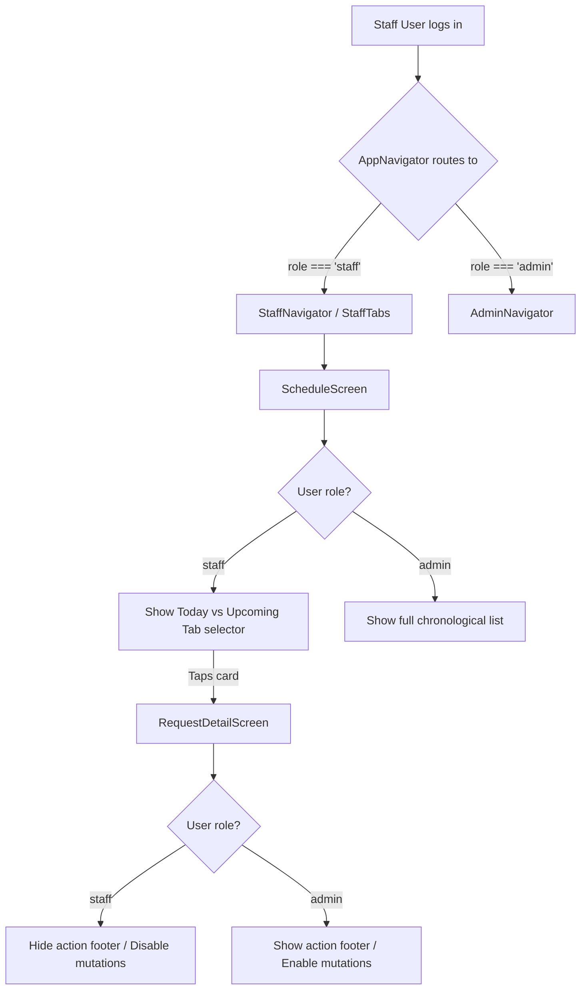

# Release 8Q: Mobile Staff Daily Workflow Planning

**Status:** Planning
**Priority:** High (Enable mobile daily visit workflow for staff members)
**Risk to Production:** None (Frontend UI and navigation filters only, no backend changes)
**Terraform Required:** No
**Backend Changes:** None (reuses existing backend-level Cognito and DB data scoping)
**Scope:** Mobile App (`/mobile`) — Provide a staff-focused daily/upcoming schedule list, adapt detail screen to show allowed care fields, and hide administrative mutations.

---

## 1. Purpose

The React Native mobile app now supports full administrative workflows (Dashboard stats, request approval, staff assignment, tablet layout optimization, and session refresh). However, to fully support operations, the mobile client must allow staff members (`role === 'staff'`) to view their daily schedule, locate assigned clients/pets, and review specific care notes on the go.

This release plans a staff-focused daily workflow. It leverages the existing role-based backend authorization filters and sanitizes UI elements to show only staff-appropriate fields and actions.

---

## 2. Context & Role Constraints

### A. Backend Scoping & Sanitization (Pre-existing)
The backend lambda handlers already enforce strict role-based data boundaries when requests are queried:
1. **GET `/admin/requests` (when querying `status = ALL`):**
   In [admin_handler.py](file:///c:/Users/mattn/OneDrive/Desktop/togs_and_dogs_website/src/backend/handlers/admin_handler.py#L1708-L1711), the database query filters items based on the requester's Cognito claims:
   ```python
   if role == 'staff' and user_email:
       # Staff only see jobs assigned to them
       filter_expressions.append("worker_id = :wid")
       expression_values[":wid"] = user_email
   ```
   This ensures staff members *cannot* retrieve other staff members' or admin-only bookings.
2. **GET Specific Statuses:**
   Querying status-specific endpoints (e.g., `status = PENDING_REVIEW`) is blocked for non-admins, meaning staff must strictly query `status = ALL`.
3. **Data Shaping (`sanitize_booking_for_role`):**
   In [auth.py](file:///c:/Users/mattn/OneDrive/Desktop/togs_and_dogs_website/src/backend/common/auth.py#L75-L122), the backend automatically filters out administrative fields before returning them to staff or clients.
   - **Stripped fields:** `meet_and_greet_notes`, `internal_pricing_notes`, `internal_notes`, `admin_notes`, `staff_notes` (internal reviews *about* staff), `private_notes`, `pricing_notes`, `discount_rationale`, `owner_comments`, `operational_comments`, and `audit_log`.
   - **Retained fields:** Client name, address, contact details, pet profiles (feeding notes, medication notes, behavioral notes), emergency contact info, veterinary information, and special instructions.

### B. Frontend Role Checks & Navigation
1. In [AppNavigator.tsx](file:///c:/Users/mattn/OneDrive/Desktop/togs_and_dogs_website/mobile/src/navigation/AppNavigator.tsx#L196-L197), when `role === 'staff'`, the user is routed into `StaffNavigator` which loads `StaffTabs` containing only the `Schedule` screen.
2. We must reuse the existing `RequestDetailScreen` for showing visit details but strip out any admin operations dynamically based on the current user's role.

---

## 3. Proposed Solution & Architecture

### 1. Staff "Today" vs "Upcoming" View (`ScheduleScreen.tsx`)
Instead of displaying a long chronological schedule list, staff need a clear way to see what visits they must perform **today** vs. what they have scheduled in the **future**. We will introduce a segmented control (tab toggle) at the top of the schedule screen when `role === 'staff'`:

```
+------------------------------------------+
|               My Schedule                |
|  +--------------------+---------------+  |
|  |       Today        |   Upcoming    |  |
|  +--------------------+---------------+  |
|                                          |
|  Today (Wed, Jun 4)                      |
|  🐾 Buddy - Dog Walking                  |
|  Client: John Doe   Window: 12pm-2pm     |
|                                          |
+------------------------------------------+
```

- **Local State:** Introduce `activeTab` (`'today' | 'upcoming'`) defaulted to `'today'`.
- **Filtering Logic:** 
  - Compare the visit date `dateStr` with `todayStr` (local timezone date string: `YYYY-MM-DD`).
  - **Today Tab:** Keep only visits where `visit.date === todayStr`.
  - **Upcoming Tab:** Keep only visits where `visit.date > todayStr`.
  - **Admin/Owner View:** Bypass the tabs entirely; admins will continue to see the full chronological schedule list grouped by date.

### 2. Contextual Empty States
We will customize the empty list state for staff based on the active tab:
- **Today Tab Empty:** Show title `"No Visits Today"`, subtitle `"You have no assigned visits scheduled for today. Enjoy your day off!"`.
- **Upcoming Tab Empty:** Show title `"No Upcoming Visits"`, subtitle `"You have no upcoming assigned visits scheduled. Check back later."`.

### 3. Detail Screen Reuse & Redactions (`RequestDetailScreen.tsx`)
To keep maintenance simple, we will reuse `RequestDetailScreen` rather than duplicating files.
- **Hiding Admin Footer:** We will extract `role` from `useAuth()` on the screen and override `showFooter`:
  ```typescript
  const { logout, role } = useAuth();
  ...
  const showFooter = role !== 'staff' && (isPending || isApproved || isAssigned);
  ```
  This immediately hides the "Approve Booking", "Assign Staff", and "Change Staff" buttons, as well as their related confirmation modals and sheets.
- **Field Display Audit:**
  - **Visible:** Client name, address (with deep link to Maps), phone (with dialer link), email (with mailto link), pet profiles (species, breed, age, feeding notes, medication notes, behavioral/care notes), emergency contact name/phone, vet details (clinic, vet name, phone, address link), and special instructions.
  - **Redacted:** Sensitive internal fields are already safely set to `null` by the backend.



### 4. Future Candidate Actions (Out of Scope for 8Q)
While not implemented in this phase, the design lays the foundation for future staff actions:
- **Mark Arrived / Mark Completed:** Will invoke new backend status endpoints (e.g. `ARRIVED`, `COMPLETED`).
- **Visit Notes / Photo Upload:** Will integrate with pet care cards and S3 bucket image ingestion.

---

## 4. Proposed Changes

### [Component Name: Mobile App]

#### [MODIFY] [ScheduleScreen.tsx](file:///c:/Users/mattn/OneDrive/Desktop/togs_and_dogs_website/mobile/src/screens/ScheduleScreen.tsx)
- Add a local state variable `activeTab` of type `'today' | 'upcoming'` initialized to `'today'`.
- Modify `getSections()` logic:
  - If `role === 'staff'`, filter the `visits` list:
    - If `activeTab === 'today'`, include only items where `visit.date === todayStr`.
    - If `activeTab === 'upcoming'`, include only items where `visit.date > todayStr`.
- In the return JSX, if `role === 'staff'`, render a segmented toggle control bar below the header:
  - Two buttons styled as unified selectors with highlighted states matching `COLORS.primary`.
- In `ListEmptyComponent`, render tailored empty states dynamically:
  - Check if `role === 'staff'`. If so, check `activeTab` to display the personalized texts ("No Visits Today" / "No Upcoming Visits") and illustrative icons.
- Add pull-to-refresh control onto the list (already present).

#### [MODIFY] [RequestDetailScreen.tsx](file:///c:/Users/mattn/OneDrive/Desktop/togs_and_dogs_website/mobile/src/screens/RequestDetailScreen.tsx)
- Destructure `role` from the `useAuth()` hook.
- Modify `showFooter` condition to hide the action buttons footer if `role === 'staff'`:
  ```typescript
  const showFooter = role !== 'staff' && (isPending || isApproved || isAssigned);
  ```
- Ensure styling and layout remain safe for phone and tablet sizes via the existing `ContentContainer`.

---

## 5. Verification Plan

### Automated Tests
Run checking commands inside the `/mobile` directory:
```bash
# Validate that TypeScript has no errors
npx tsc --noEmit

# Validate Expo dependency tree health
npx expo-doctor
```

### Manual Verification Checklist
Launch Metro on a local port:
```bash
npx expo start --clear --lan --port 8082
```

1. **Log in as a Staff User:**
   - [ ] Verify that authentication succeeds and redirects to the "My Schedule" tab list.
2. **Today Tab View:**
   - [ ] Confirm that only visits scheduled for the current date are displayed.
   - [ ] Confirm the header shows the correct title "My Schedule".
3. **Upcoming Tab View:**
   - [ ] Tap the "Upcoming" segment. Verify it switches immediately and shows visits for tomorrow and beyond.
4. **Empty State Validation:**
   - [ ] If no visits are assigned for today, verify the clean custom "No Visits Today" state appears.
   - [ ] If no visits are assigned for the future, verify the "No Upcoming Visits" state appears.
5. **Pull-to-refresh:**
   - [ ] Perform a pull-to-refresh on both tabs. Ensure the loading spinner animates and retrieves data without errors.
6. **Detail Screen Inspection:**
   - [ ] Tap on an assigned visit card.
   - [ ] Verify the `RequestDetailScreen` opens successfully.
   - [ ] **Action Footer:** Confirm that the action footer (Approve/Assign buttons) is completely hidden.
   - [ ] **Care Fields:** Verify that client details, pet profile care notes, emergency contact, and vet info render correctly.
   - [ ] **Address/Phone/Email Links:** Verify that tapping the address, phone number, and email opens Maps, Phone Dialer, and Mail client without runtime exceptions.
7. **Admins Verification:**
   - [ ] Log in as an admin or owner.
   - [ ] Verify that no toggle tabs appear on the "Dispatch Schedule" page.
   - [ ] Verify that the admin can see all active scheduled visits.
   - [ ] Verify that opening details shows the footer action buttons (Approve / Assign Staff / Change Staff) as normal.

---

## 6. Rollback Plan

If any visual regression or navigation crashes occur during testing:
1. Revert changes:
   ```bash
   git checkout -- mobile/src/screens/ScheduleScreen.tsx
   git checkout -- mobile/src/screens/RequestDetailScreen.tsx
   ```
2. Restart the Metro bundler.

---

## 7. AG Implementation Prompt — DO NOT RUN UNTIL MATTHEW APPROVES

```
AG — please implement Release 8Q: Mobile Staff Daily Workflow.

Work strictly within /mobile:

1. Update mobile/src/screens/ScheduleScreen.tsx:
   - Add a state variable: const [activeTab, setActiveTab] = useState<'today' | 'upcoming'>('today');
   - In getSections(), if role === 'staff', filter the visits list:
     * If activeTab === 'today', only keep visits where visit.date === todayStr.
     * If activeTab === 'upcoming', only keep visits where visit.date > todayStr.
   - Add a beautiful toggle control bar below the header row when role === 'staff'. Give it premium active/inactive tab styles matching COLORS.primary and COLORS.background.
   - Customize ListEmptyComponent for staff:
     * If role is 'staff' and activeTab is 'today': Show "No Visits Today" with subtitle "You have no assigned visits scheduled for today. Enjoy your day off!".
     * If role is 'staff' and activeTab is 'upcoming': Show "No Upcoming Visits" with subtitle "You have no upcoming assigned visits scheduled. Check back later.".
     * Otherwise show the admin fallback.

2. Update mobile/src/screens/RequestDetailScreen.tsx:
   - Extract 'role' from useAuth() alongside 'logout': const { logout, role } = useAuth();
   - Update showFooter computation so it is false when role === 'staff':
     const showFooter = role !== 'staff' && (isPending || isApproved || isAssigned);

Verify that your changes compile and pass validation:
- npx tsc --noEmit
- npx expo-doctor

Do not modify backend code, Terraform, AWS configurations, or web portal code. Pause and report observations once complete.
```
