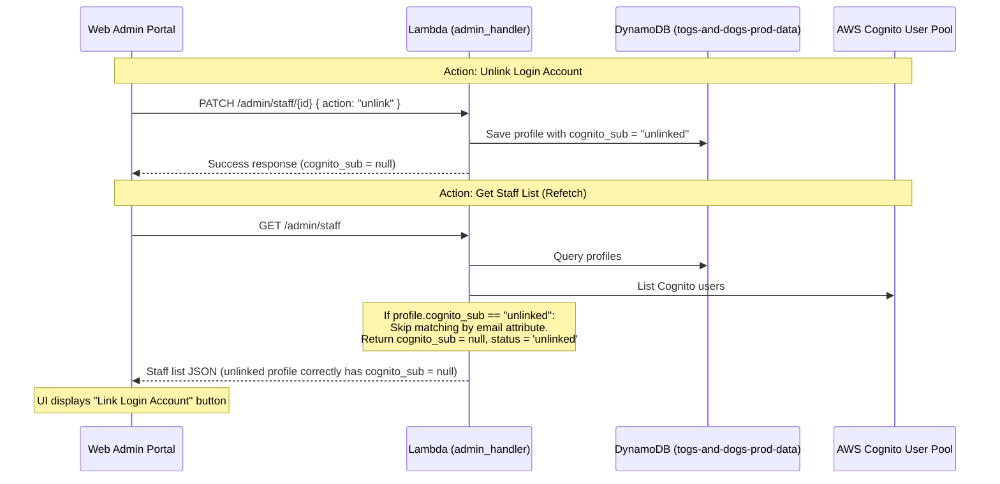

# Release 8S: Staff Management Login Account Controls Fix

**Status:** Planning
**Priority:** High (Resolves administrative lockouts, unlinking sync issues, and security action reliability)
**Risk to Production:** Low (Administrative dashboard backend/web fixes only, no public client booking impact)
**Terraform Required:** No
**Backend Changes:** Yes (Backend admin handler only, no DynamoDB schema or Cognito User Pool updates)
**Scope:** Admin Portal Web App (`/web`) & Backend Lambda (`/src/backend/handlers/admin_handler.py`)

---

## 1. Purpose

During validation of the mobile staff daily workflow, two critical bugs were identified in the **Staff Management** web portal controls:
1. **Unlink Login Failure:** Clicking the "Unlink Login" button reports success to the administrator, but the UI continues to show the login account as linked (with the "Unlink Login" and "Account Security" buttons visible) because the backend re-links them automatically by email.
2. **Set Temporary Password Failure:** Triggering "Set Temporary Password" (or resending invites/triggering reset emails) is unreliable and fails on Cognito write commands due to mismatches between Cognito primary Usernames (which are often UUIDs) and user emails or subs.

This release fixes both bugs by introducing an explicit unlinked state, preventing dynamic auto-merging for unlinked records, and dynamically resolving the exact primary Cognito Username prior to executing Cognito write operations.

---

## 2. Current State & Issue Analysis

### A. Unlink Login & Auto-Merge Mismatch
When an administrator clicks "Unlink Login", the frontend PATCHes `/admin/staff/{id}` with `{ action: "unlink" }`.
- **Backend Unlink Logic:** In `admin_handler.py` (lines 1063–1069), the backend pops `cognito_sub`, `cognito_username`, and `cognito_status` from the DynamoDB record and saves it:
  ```python
  elif action == 'unlink':
      staff_profile.pop('cognito_sub', None)
      staff_profile.pop('cognito_username', None)
      staff_profile.pop('cognito_status', None)
      items_table.put_item(Item=staff_profile)
  ```
- **The Bug (GET Auto-Merge):** In GET `/admin/staff` (lines 270–283) and GET `/admin/clients` (lines 1348–1360), the list retrieval endpoints dynamically search Cognito and merge details back into profiles using a fallback email match:
  ```python
  if (s_sub and s_sub == cu_sub) or (s_email and s_email == cu_email):
      cog_match = cu
  ```
  Because the profile email (e.g. `mattnicomn10@yahoo.com`) still exists, the GET query matches it to Cognito, dynamically re-attaches `cognito_sub`, `cognito_username`, and `cognito_status`, and returns it. The frontend receives a seemingly linked profile and displays the wrong buttons.

### B. Account Security Actions Mismatch
When setting a temporary password or resetting a password, the backend resolves the username parameter for Cognito APIs:
- **Backend Resolution Logic:**
  ```python
  else:
      username = user_profile.get('email') or user_profile.get('cognito_sub') or user_profile.get('cognito_username')
  ```
- **The Bug (Cognito Write Restriction):** If `email` is present, it uses `email` (e.g., `mattnicomn10@yahoo.com`). However, write commands such as `admin_set_user_password`, `admin_reset_user_password`, and `admin_add_user_to_group` in Cognito do **not** support alias resolution; they strictly require the **exact primary Cognito Username** (often a UUID or user pool Username string). Passing the email triggers a `UserNotFoundException` or silently fails.
- **Unlinked Execution Bug:** If the account is unlinked, the backend will still attempt to run security commands using the profile's email address, which is unsafe.

---

## 3. Proposed Solution & Architecture



### 1. Store Explicit "Unlinked" Sentinel
- Instead of popping `cognito_sub` entirely (which makes it look like it was never linked), the backend will set `cognito_sub = 'unlinked'` and `cognito_status = 'unlinked'` in DynamoDB upon unlinking.

### 2. Skip Auto-Merge for Unlinked Sentinels
- In GET `/admin/staff` and GET `/admin/clients`, check if `cognito_sub == 'unlinked'`.
- If it is `'unlinked'`, skip the email-based auto-merge, and set `cognito_sub = None` and `cognito_status = 'unlinked'` in the return payload so the frontend receives a clean unlinked status.

### 3. Robust Username Resolution
- For POST `/reset-password`, `/set-temp-password`, and `/resend-invite` endpoints:
  - If the profile is unlinked (`cognito_sub == 'unlinked'` or missing), immediately block the request with a `400 Bad Request` error: `"Profile is not linked to a Cognito user"`.
  - Resolve the true Cognito `Username` string by calling `admin_get_user` on the `cognito_sub` or `cognito_username`.
  - If `UserNotFoundException` is raised, search Cognito users using the list filter `email = "..."`.
  - Extract the exact `Username` field returned by Cognito and pass that exact string to Cognito's write operations.

---

## 4. Proposed Changes

### [Component Name: Backend Lambda]

#### [MODIFY] [admin_handler.py](file:///c:/Users/mattn/OneDrive/Desktop/togs_and_dogs_website/src/backend/handlers/admin_handler.py)
- **GET `/admin/staff` (lines 270–292)**:
  - Check `cognito_sub` for `'unlinked'`.
  - If `'unlinked'`, skip Cognito matching, set `s['cognito_sub'] = None`, `s['cognito_status'] = 'unlinked'`, and append to `merged_staff`.
- **GET `/admin/clients` (lines 1347–1368)**:
  - Apply the identical `'unlinked'` skip-merge check.
- **PATCH `/admin/staff/{id}` (line 1063) & `/admin/clients/{id}` (line 1548)**:
  - On `action == 'unlink'`:
    Set `profile['cognito_sub'] = 'unlinked'`, `profile['cognito_status'] = 'unlinked'`, and remove `cognito_username` attribute. Update DynamoDB and return the updated profile.
- **Account Security Routes (POST `/reset-password`, `/set-temp-password`, `/resend-invite` - lines 1238–1242)**:
  - Retrieve the Cognito identifier: `cognito_user_id = user_profile.get('cognito_sub') or user_profile.get('cognito_username') or user_profile.get('email')`.
  - Block actions if `cognito_user_id` is empty, null, or `'unlinked'`.
  - Call `admin_get_user` on `cognito_user_id` to get `exact_username = cog_resp.get('Username')`.
  - If `UserNotFoundException` occurs, search Cognito via `list_users(Filter='email = "..."')` and extract `exact_username`.
  - Use `exact_username` for Cognito write APIs.

---

## 5. Verification Plan

### Automated Tests
Run python tests locally in the backend workspace to ensure no regressions occur:
```bash
pytest tests/backend/
```

### Manual Verification Checklist
Using the staff test account `mattnicomn10@yahoo.com` via the web Admin Portal:

1. **Unlink Validation:**
   - [ ] Log in as Admin. Navigate to **Staff Management**. Locate `mattnicomn10@yahoo.com`.
   - [ ] Confirm its status is `Active` and the action menu shows **Unlink Login** and **Set Temporary Password**.
   - [ ] Click **Unlink Login** and confirm.
   - [ ] Verify the status badge updates immediately to `No Login` and the button swaps to **Link Login Account**.
   - [ ] Refresh the page. Verify the profile remains in the `No Login` state (does not auto-merge back).
2. **Action Block Validation:**
   - [ ] Verify that while unlinked, the **Set Temporary Password** and **Send Password Reset Email** options are completely hidden in the UI.
3. **Linking Validation:**
   - [ ] Click **Link Login Account**. Enter `mattnicomn10@yahoo.com` and submit.
   - [ ] Verify the profile links successfully, the status returns to `Active`, and security buttons reappear.
4. **Set Temporary Password Validation:**
   - [ ] Click **Set Temporary Password**. Enter `TempPass456!` and submit.
   - [ ] Verify the success notification appears.
   - [ ] Log into the mobile app (or web portal) using `mattnicomn10@yahoo.com` and `TempPass456!` to confirm the password change took effect in Cognito.

---

## 6. Rollback Plan

If any API errors or lockouts occur during deployment:
1. Revert `admin_handler.py` to the production commit:
   ```bash
   git checkout origin/main -- src/backend/handlers/admin_handler.py
   ```
2. Redeploy the backend stack.

---

## 7. AG Implementation Prompt — DO NOT RUN UNTIL MATTHEW APPROVES

```
AG — please implement Release 8S: Staff Management Login Controls Fix.

Apply changes strictly in src/backend/handlers/admin_handler.py:

1. Update GET /admin/staff and GET /admin/clients merger loops:
   - Check if the DynamoDB profile has cognito_sub == 'unlinked'.
   - If true, skip Cognito matching. Set profile['cognito_sub'] = None and profile['cognito_status'] = 'unlinked'.
   - Otherwise, proceed with Cognito search and email auto-merge as before.

2. Update PATCH /admin/staff/{id} and PATCH /admin/clients/{id} unlink actions:
   - When action == 'unlink', set profile['cognito_sub'] = 'unlinked' and profile['cognito_status'] = 'unlinked'. Pop 'cognito_username' if present.
   - Save to database and return the updated profile.

3. Update POST reset-password, set-temp-password, and resend-invite:
   - Retrieve the user identifier: cognito_user_id = user_profile.get('cognito_sub') or user_profile.get('cognito_username') or user_profile.get('email')
   - If cognito_user_id is missing, null, or 'unlinked', return a 400 bad request error: "Profile is not linked to a Cognito user".
   - Retrieve the exact primary Cognito Username:
     * Call admin_get_user(UserPoolId=user_pool_id, Username=cognito_user_id)
     * If UserNotFoundException and email attribute is present, call list_users(UserPoolId=user_pool_id, Filter='email = "..."') and extract Username from the first matching user.
   - Use the resolved exact username string for admin_set_user_password and admin_reset_user_password calls.

Verify with:
- pytest tests/backend/

Do not modify Terraform, Cognito pool configurations, web frontend code, or mobile client code. Report results when complete.
```
