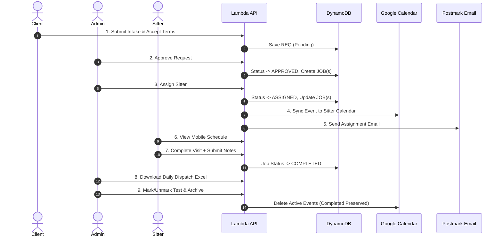

# Release 9E Planning: Ryan Production Readiness Dry Run

**Status**: Planning
**Priority**: High (pre-launch checkpoint)
**Risk to Production**: Very Low (operational dry-run with test identities)
**Terraform Required**: No
**Backend Changes**: No
**Frontend Changes**: No
**Mobile Changes**: No

---

## 1. Dry Run Objective
The objective of this dry run is to execute a controlled, end-to-end rehearsal of the entire pet care workflow on the live production environment. The dry run simulates the system from the perspectives of the Administrator (Ryan), the Staff Member (Sitter), and the Client to guarantee operational readiness before broader testing.

Specifically, this dry run will validate:
1. **Admin Control**: Ryan can navigate the dashboard, approve bookings, assign sitters, inspect visit notes, monitor connection health, and download the daily dispatch spreadsheet.
2. **Staff Workflow**: Sitters can check their schedules, complete individual visits, and submit feedback/notes.
3. **Client Flow**: Pet owners can accept terms, submit intake requests, and track status.
4. **Integration Health**: Correct Google Calendar synchronization and Postmark email delivery occurs.

---

## 2. Test Scenario Design

We will simulate four distinct bookings to cover all critical lifecycle paths:

| Booking Type | Purpose | Key Attributes | Expected Lifecycle |
|--------------|---------|----------------|--------------------|
| **Scenario A**: Single-day | Verify standard intake, approval, sitter assignment, and full completion. | 1 visit, assigned to staff | Submitted $\rightarrow$ Approved $\rightarrow$ Assigned $\rightarrow$ Completed. |
| **Scenario B**: Multi-day | Verify multi-day job expansion, partial/per-visit completion, notes history, and calendar sync. | 3 consecutive visits, assigned to staff | Submitted $\rightarrow$ Approved $\rightarrow$ Assigned $\rightarrow$ Partially Completed $\rightarrow$ Fully Completed. |
| **Scenario C**: Test Booking | Verify test data indicator boundary controls. | Marked as `[TEST DATA]` | Submitted $\rightarrow$ Marked as Test $\rightarrow$ Checked in Admin UI $\rightarrow$ Verified hidden from Client views. |
| **Scenario D**: Archive Flow | Verify cleanup procedures, active job deletion, completed job preservation, and unarchive safety. | Multi-day with 1 completed visit and 2 active visits | Submitted $\rightarrow$ Approved $\rightarrow$ Assigned $\rightarrow$ 1 Completed $\rightarrow$ Archived (active jobs deleted, completed preserved) $\rightarrow$ Unarchived (active restored). |

---

## 3. Roles and Test Accounts

We will utilize the following pre-configured Cognito production accounts:

* **Administrator**: `admin@toganddogs.com`
  * *Role*: Owner / Administrator
  * *Purpose*: Navigate Admin Dashboard, approve requests, assign workers, monitor health, export dispatch.
* **Staff Member**: `mattnicomn10@yahoo.com`
  * *Role*: Staff / Sitter (Staff Test User)
  * *Purpose*: Log in, view schedule, complete visits, submit visit notes.
* **Client / Pet Owner**: `brearockwell@gmail.com`
  * *Role*: Client (Brea Rockwell / Test Client)
  * *Purpose*: Accept terms, submit single/multi-day care requests, view bookings.

*Note: All accounts are fully active in Cognito. No new account registration or Cognito modification is required for this dry run.*

---

## 4. End-to-End Validation Steps

The dry run will follow these sequence steps:



1. **Public Intake & Terms**: Client logs in, accepts the Terms & Privacy policy, and submits requests for Scenarios A, B, C, and D.
2. **Admin Approval**: Admin approves requests on the dashboard.
3. **Staff Assignment**: Admin assigns `mattnicomn10@yahoo.com` to Scenarios A, B, and D.
4. **Google Calendar Event Creation**: Verify events are successfully created on the Google Calendar.
5. **Postmark Email Delivery**: Verify sitter receives assignment notification emails.
6. **Sitter Schedule Visibility**: Sitter logs in and verifies upcoming visits are visible.
7. **Per-Visit Completion**: Sitter marks visits as `COMPLETED` and enters visit notes (e.g. *"Joey was a good boy today!"*).
8. **Admin Visibility**: Admin verifies completion status, counts, and visit notes on the dashboard.
9. **Daily Dispatch Export**: Admin clicks the Export button and verifies the downloaded sheet displays upcoming scheduled visits, excluding archived, cancelled, or test records.
10. **Archive & Test Cleanup**: Admin cleans up the test data:
    * Scenarios A and B: Completed, then Archived with reason `"Release 9E dry run completed"`.
    * Scenario C: Checked, then Marked as Test, then Archived.
    * Scenario D: 1 completed, 2 active $\rightarrow$ Archived $\rightarrow$ Verify active events deleted from Google Calendar, completed preserved $\rightarrow$ Unarchived $\rightarrow$ Active restored.

---

## 5. Data Safety and Guardrails

To prevent real customer confusion and ensure system hygiene, the following guidelines are enforced:

* **Prefix and Label Naming**: All requests, clients, and pets must be named with clear test labels (e.g., Client Name: `TestClient_9E`, Pet Name: `TestPet_9E`).
* **Controlled Notifications**: Verify that Postmark email delivery is only sent to the designated test accounts (`brearockwell@gmail.com` and `mattnicomn10@yahoo.com`). Do not enter real customer email addresses under any circumstances.
* **No Destructive Deletion**: Do not execute bulk DynamoDB purges.
* **Verification Caching Guard**: Ensure that checking status does not flood Google APIs (Release 9C caching validates locally).
* **Calendar Cleanup**: Ensure all active calendar events created during the dry run are deleted during the archiving step.

---

## 6. Success and Readiness Criteria

The dry run will be considered a success and "Ready for Ryan Testing" when:

* All validation steps (1–10) complete without errors or exceptions in either the frontend console or Lambda execution logs.
* Google Calendar events are created on assignment, and deleted on archiving (for active jobs).
* Completed jobs, completed notes, completed_by, and completed_at are preserved after archiving.
* The Daily Sitter Dispatch sheet correctly filters out test, cancelled, and archived records.
* **Blocker Criteria**: Any API Gateway `500` error, unhandled promise rejection, Google OAuth failure, calendar event duplication, or email delivery failure is a launch blocker.
* **Non-Blocker Criteria**: Minor UI styling alignments or non-blocking console warnings (e.g., deprecated options warnings) are not blockers.

### Manual Evidence to Capture
* Screenshot of the Admin Dashboard showing the Google Calendar connected status badge.
* Screenshot of the Admin Dashboard displaying visit completion state and notes.
* Screenshot of the Google Calendar showing the synced events.
* Copies of the sent Postmark email notifications.
* The downloaded `TogAndDogs_Offline_Backup_*.xlsx` file showing the `Daily Dispatch` worksheet.

---

## 7. Operational Risk Controls
* **No Manual Database Mutations**: All actions must be performed through the official Admin Portal, Client Portal, or Staff Portal interfaces. No direct AWS console DynamoDB writes.
* **Sitter Calendar Event Cleanup**: Confirm the Google Calendar events for the test sitter are deleted after the run.
* **No EAS Builds**: Mobile testing is restricted to the browser PWA simulation. No mobile app binary builds or EAS updates are authorized.

---

## 8. Dry Run Checklist and Evidence Log

| Step | Action | Expected Output | Status (Pass/Fail) | Evidence Captured |
|------|--------|-----------------|--------------------|-------------------|
| 1.1  | Log in as Client (`brearockwell@gmail.com`) | Successfully authenticated and redirected to Client Portal. | | |
| 1.2  | Submit Scenario A (Single-day) | Request registered, parent status `PENDING`. | | |
| 1.3  | Submit Scenario B (Multi-day: 3 days) | Request registered, parent status `PENDING`. | | |
| 1.4  | Submit Scenario C (Single-day test) | Request registered, parent status `PENDING`. | | |
| 1.5  | Submit Scenario D (Multi-day archive) | Request registered, parent status `PENDING`. | | |
| 2.1  | Log in as Admin (`admin@toganddogs.com`) | Authenticated. Google Calendar status badge shows `CONNECTED`. | | |
| 2.2  | Approve Scenario A, B, D | Parent statuses update to `APPROVED`. Child jobs created. | | |
| 2.3  | Mark Scenario C as Test | Badge `[TEST DATA]` and blue highlight borders render in Admin. | | |
| 2.4  | Assign sitter to Scenarios A, B, D | Sitter assigned. Statuses transition to `ASSIGNED`. | | |
| 2.5  | Check Google Calendar | Google Calendar events created for each active child job. | | |
| 2.6  | Check Postmark Mail | Sitter receives assignment emails for Scenarios A, B, D. | | |
| 3.1  | Log in as Sitter (`mattnicomn10@yahoo.com`) | Authenticated. Dashboard lists assigned appointments. | | |
| 3.2  | Complete Scenario A visit | Job status -> `COMPLETED`, notes submitted. | | |
| 3.3  | Complete Scenario B (Day 1) visit | Job status -> `COMPLETED`, notes submitted. | | |
| 3.4  | Complete Scenario D (Day 1) visit | Job status -> `COMPLETED`, notes submitted. | | |
| 4.1  | View completions in Admin | Scenario A completed count `1/1`. Scenario B/D `1/3` (partial). | | |
| 4.2  | Download Daily Sitter Dispatch Excel | Workbook downloads. `Daily Dispatch` is the first sheet. | | |
| 4.3  | Verify Excel dispatch rows | Lists only active/completed jobs within 7 days, excluding Scenario C. | | |
| 5.1  | Archive Scenario A, B | Parent status `ARCHIVED`. Child job completed notes preserved. | | |
| 5.2  | Archive Scenario D | Parent status `ARCHIVED`. Sitter calendar events for Days 2 & 3 deleted. | | |
| 5.3  | Unarchive Scenario D | Parent status restored to `ASSIGNED`. Days 2 & 3 events recreated. | | |
| 5.4  | Final Archive of Scenario D & C | All records archived for validation clean-up. | | |

---

## 9. Deployment Expectations
* **Code Deployment**: None.
* **Infrastructure Deployment**: None.
* **Static Assets**: None.
* *Note: The dry run validates the existing production code base version `0f4e5b6`.*

---

## 10. AG Execution Prompt — DO NOT RUN UNTIL MATTHEW APPROVES

```
AG — perform the Release 9E Ryan Production Readiness Dry Run validation.

Ensure you use ONLY the test accounts:
- Admin: admin@toganddogs.com
- Client: brearockwell@gmail.com
- Staff: mattnicomn10@yahoo.com

=== 1. Public Client Intake ===
Use python/boto3 or the browser subagent to simulate Client login and submit requests for:
- Scenario A (Single-day: Today)
- Scenario B (Multi-day: Today + 2 days, 3 visits)
- Scenario C (Single-day: Today)
- Scenario D (Multi-day: Today + 2 days, 3 visits)

=== 2. Admin Actions ===
Approve Scenarios A, B, and D.
Mark Scenario C as a Test Booking.
Assign worker 'mattnicomn10@yahoo.com' to Scenarios A, B, and D.

=== 3. Sitter Completion ===
Simulate the sitter logging in and completing:
- Scenario A (Single-day) with notes: "Scenario A complete. Joey did great!"
- Scenario B (Visit 1) with notes: "Scenario B Visit 1 complete."
- Scenario D (Visit 1) with notes: "Scenario D Visit 1 complete."

=== 4. Offline Dispatch Verification ===
Trigger handleExportData from the Admin view, parse the exported sheet via python, and verify:
- "Daily Dispatch" is the first sheet.
- Rows are sorted by date, worker, and window.
- Scenario C is excluded.

=== 5. Archive & Lifecycle Cleanup ===
Archive Scenario A and B (verify completed notes are preserved).
Archive Scenario D (verify active calendar events are deleted, completed preserved).
Unarchive Scenario D (verify restored to ASSIGNED and calendar events recreated).
Finally, Archive Scenario D and C to complete cleanup.

Report the validation checklist status and capture screenshots of completed phases.
```
