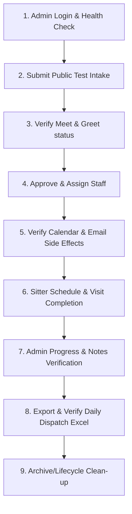

# Release 9F Planning: Ryan Structured Testing Handoff Plan

## 1. Purpose
The purpose of Release 9F is to establish a clear, structured production testing handoff plan for the Administrator (Ryan). This plan guides Ryan through verifying the system's live operations—encompassing client intake, terms acceptance, Meet & Greet verification, administrative approvals, team assignment, Google Calendar integration, Postmark notifications, mobile sitter completion, and the offline dispatch Excel export—using approved test credentials.

## 2. Current Readiness Status
* **Release 9C**: Google Calendar Connection Status Banner is complete and fully deployed.
* **Integrations**: Google Calendar reconnection verified healthy.
* **Release 9D**: Daily Sitter Dispatch sheet integrated as the first tab in the Admin Dashboard export workflow.
* **Release 9E**: Controlled production readiness dry run completed successfully.
* **Blocker Status**: No critical issues or blocker defects found.

---

## 3. Ryan Testing Scope

### 3.1. What Ryan Should Test
* Log in as Admin and confirm Google Calendar status card is showing `CONNECTED`.
* Verify client intake submissions can be successfully received.
* Perform Meet & Greet completion validation via the admin dashboard.
* Approve intake requests, verify assignment of sitters, and check cascade updates.
* Confirm synchronized calendar events on the assigned sitter’s calendar.
* Verify delivery of assignment emails via Postmark.
* Verify mobile staff view and completed visit status updates with notes.
* Export and download the Daily Sitter Dispatch Excel sheet, confirming correct filters (active visits within 7 days, excluding test/archived records).
* Validate the archive/unarchive controls for clean data lifecycle management.

### 3.2. What Ryan Should Avoid
* **No Direct DB Mutations**: Do not attempt to query or edit DynamoDB tables directly.
* **No Real Client Modifications**: Do not alter, edit, cancel, or delete actual customer records.
* **No Client Email Dispatches**: Do not enter real customer email addresses in any test requests.
* **No Disconnections**: Do not disconnect the Google Calendar account from the Admin page unless instructed.
* **No Destructive Actions**: Do not use any purge or bulk-delete operations.

### 3.3. What Counts as Pass/Fail
* **Pass**: All actions (intake, M&G satisfaction, approval, assignment, completion, notes tracking, Excel dispatch export, and archiving) complete smoothly with correct UI displays and expected calendar/email side effects.
* **Fail**: Any operation that produces a console error, a server `500` error, duplicates calendar events, exposes OAuth tokens, fails to sync schedule changes, or prints missing active records on the Excel dispatch sheet.

### 3.4. Requested Feedback and Evidence
* Screenshots of the Admin Dashboard showing Google Calendar health badge.
* Screenshots of completed visit progress cards and notes in the Admin Portal.
* Copy or screenshot of the Postmark assignment email.
* Exported `TogAndDogs_Offline_Backup_*.xlsx` file.
* Completed checklist feedback form detailing any observed minor visual or operational issues.

---

## 4. Recommended Ryan Test Flow

The recommended testing flow is structured as a step-by-step end-to-end walkthrough:



1. **Admin Login & Health Check**: Log into the Admin Dashboard (`admin@toganddogs.com`) and confirm that the Google Calendar integration status card displays a green `CONNECTED` state.
2. **Submit Public Test Intake**: Access the public intake form and submit a new request (e.g. for Client Name: `TestClient_Ryan` and Sitter: `mattnicomn10@yahoo.com`) ensuring Terms of Use and Privacy Policy boxes are checked.
3. **Verify Meet & Greet Status**: Select the request in the Admin Dashboard and verify that the system enforces the Meet & Greet check. Mark the Meet & Greet as completed (using the approved `VERIFY_MEET_GREET` action).
4. **Approve & Assign Staff**: Transition the request status to `APPROVED`. Once child jobs are created, assign the staff user `mattnicomn10@yahoo.com` to the appointments.
5. **Verify Calendar & Email Side Effects**: Confirm that the appointments appear as events on the staff calendar and that an assignment email notification was received.
6. **Sitter Schedule & Visit Completion**: Log into the Sitter dashboard as the staff user, view the assigned visits, complete the appointments, and submit feedback notes (e.g., *"Walk completed successfully. Joey was great!"*).
7. **Admin Progress & Notes Verification**: Switch back to the Admin Dashboard and verify that the request progress shows completed counts and includes the sitter's feedback notes.
8. **Export & Verify Daily Dispatch Excel**: Click the "Export Data" button. Verify the downloaded file features the `Daily Dispatch` tab as the first sheet and correctly lists active test bookings while omitting archived ones.
9. **Archive/Lifecycle Clean-up**: Archive the test request using the admin controls. Verify future active events are deleted from the calendar, completed event records are preserved, and clean data state is restored.

---

## 5. Testing Guardrails and Rules
* **Strict Test Identity Isolation**: Only utilize the designated test accounts (`admin@toganddogs.com`, `brearockwell@gmail.com` with Client ID `client_1697162f`, and `mattnicomn10@yahoo.com`).
* **Clear Labels**: Ensure all requests or comments generated during testing contain prefix tags (e.g., `[RYAN TEST]`).
* **No Purge Actions**: Do not perform any destructive deletes.
* **Real Customer Protection**: Do not test or input any actual client data until Matthew explicitly approves.

---

## 6. Deliverables

### 6.1. Ryan Testing Checklist

- [ ] Log in as Admin and confirm Google Calendar status displays `CONNECTED`.
- [ ] Submit public test intake request with terms accepted.
- [ ] Select request, mark Meet & Greet completed, and transition status to APPROVED.
- [ ] Assign sitter `mattnicomn10@yahoo.com` and verify the status cascades.
- [ ] Confirm Google Calendar event creation and check Postmark assignment email.
- [ ] Log in as sitter, view schedule, mark visit completed, and enter feedback notes.
- [ ] Verify completed status and notes are visible in the Admin Dashboard.
- [ ] Download Excel backup and verify `Daily Dispatch` is the first sheet and includes active test rows.
- [ ] Archive request and verify future calendar events are deleted, completed items preserved.

### 6.2. Feedback Template
```markdown
# Ryan Testing Feedback Log

* Test Date: 
* Overall Result (PASS/FAIL): 

### Observed Behavior
1. Google Calendar Integration Card Status: [Connected / Disconnected]
2. Request Approval & Assignment Workflow: [Success / Issue Details]
3. Google Calendar Events & Email Notifications: [Received / Sync Errors]
4. Sitter Completion & Notes Persistence: [Success / Notes Missing]
5. Excel Dispatch Sheet Format: [First Tab / Sorting OK / Excluded Test Data]
6. Archive/Clean-up Behavior: [Cleaned Successfully / Orphaned Events]

### Questions or UI/UX Observations:
* 
```

### 6.3. Draft Handoff Message from Matthew to Ryan
> "Hi Ryan,
> 
> The production readiness checks and dry runs for the Google Calendar integration card and the Daily Dispatch export sheet are complete and fully validated.
> 
> We are ready for you to begin structured production testing. I have created a step-by-step checklist and handoff plan under `docs/planning/release-9f-ryan-structured-testing-handoff-plan.md` to guide you through a full booking and completion lifecycle. Please use only your test accounts (`admin@toganddogs.com`, client `brearockwell@gmail.com`, and staff `mattnicomn10@yahoo.com`) and let me know if you run into any issues or have feedback.
> 
> Thanks!
> Matthew"

---

## 7. Deployment Expectations
* **Code Changes**: None.
* **Backend Deployments**: None.
* **Web Static Deployments**: None.
* **Mobile/EAS Builds**: None.

---

## 8. AG Implementation Prompt

```
================================================================================
DO NOT RUN UNTIL MATTHEW APPROVES
================================================================================
AG — Stand by to assist Ryan during structured testing. Do not run dry-run scenarios or execute modifications. Perform read-only checks on request statuses, calendar IDs, and post-testing database states when requested.
================================================================================
```
